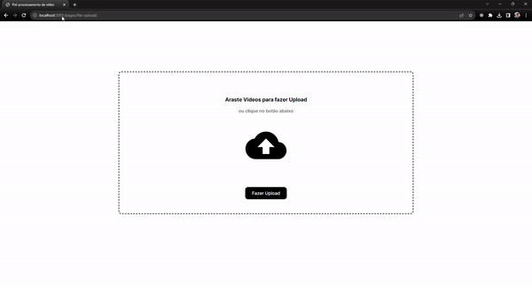

# JSExpertHub Pre-processing videos on browsers - Semana JS Expert 8.0

Seja bem vindo(a) à oitava Semana Javascript Expert. Este é o código inicial para iniciar nossa jornada.

Marque esse projeto com uma estrela 🌟 e acesse o nosso [grupo oficial no WhatsApp](https://l.erickwendel.com.br/jse8-grupo)
## Preview

🔥🔥🔥🔥🔥🔥🔥 **[Clique aqui para conferir a página final](https://bumboobee.github.io/semana-javascript-expert08/aula02-encode-144p-upload/app/pages/file-upload/)** 🔥🔥🔥🔥🔥🔥🔥

## Pre-reqs
- Este projeto foi criado usando Node.js v18.17.0
- O ideal é que você use o projeto em ambiente Unix (Linux). Se você estiver no Windows, é recomendado que use o [Windows Subsystem Linux](https://www.omgubuntu.co.uk/how-to-install-wsl2-on-windows-10) pois nas aulas são mostrados comandos Linux que possam não existir no Windows.

## Importante
- Todo dia às 18hrs estou subindo o código das aulas do dia corrente em [classes](./classes). Se você for iniciar o projeto, remova a pasta [classes](./classes) para iniciar do zero!

## Running
- Execute `npm ci` na pasta que contém o arquivo `package.json` para restaurar os pacotes
- Execute `npm start` e em seguida vá para o seu navegador em [http://localhost:3000](http://localhost:3000) para visualizar a página acima

## Checklist Features

- Video Uploader
  - [X] - Deve entender videos em formato MP4 mesmo se não estiverem fragmentados
  - [X] - Deve processar itens em threads isoladas com Web Workers
  - [X] - Deve converter fragmentos de videos em formato `144p`
  - [X] - Deve renderizar frames em tempo real em elemento canvas
  - [X] - Deve gerar arquivos WebM a partir de fragmentos

### Desafios
- [] - Encodar em 360p e 720p
- [] - Fazer encoding/decoding track de áudio
- [] - Fazer também upload de track de áudio
- [] - Concatenar o arquivo final no servidor em um arquivo só
- [] - Corrigir problema do Webm de não mostrar a duração do video
- [] - Corrigir a responsividade do site
- [] - Tentar usar outros muxers
  - https://github.com/Vanilagy/webm-muxer
  - https://github.com/Vanilagy/mp4-muxer

### Links mostrados nos aulas:
- Reuni todos os links em [referências](./referencias.md)
### Considerações
- Tire suas dúvidas sobre os desafios em nossa comunidade, o objetivo é você aprender de forma divertida. Surgiu dúvidas? Pergunte por lá!

- Ao completar qualquer um dos desafios, envie no canal **#desafios** da comunidade no **Discord**
### FAQ
- browser-sync está lançando erros no Windows e nunca inicializa:
  - Solução: Trocar o browser-sync pelo http-server.
    1. instale o **http-server**  com `npm i -D http-server`
    2. no package.json apague todo o comando do `browser-sync` e substitua por `npx http-server .`
    3. agora o projeto vai estar executando na :8080 então vá no navegador e tente acessar o http://localhost:8080/
  A unica coisa, é que o projeto não vai reiniciar quando voce alterar algum código, vai precisar dar um F5 na página toda vez que alterar algo

## SOBRE 
[1°] Identificar o video que possui tamanho grande

[2°] Encode - transformar em uma resolução menor

[3°] Voltar par a resolução menor "descomprimida" para imprimir na tela 

[3°] Transformar o video em webM

[4°] Fazer download do video

## CONCEITOS
Demuxer 
Muxer 
Encoder
Decoder 

**VEJA A PAGINA DE REFERENCIAS!!!!**

